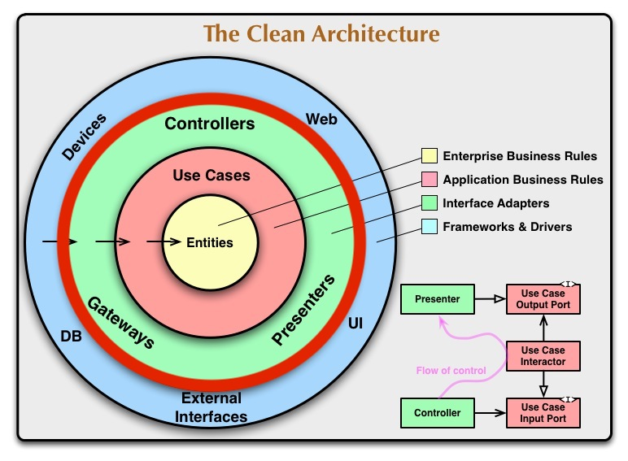

### クリーンアーキテクチャ解説

 

2018-10-30

@orepuri

---
### 本日の話

* クリーンアーキテクチャ解説

* コード例

* クリーンアーキテクチャ本を読んで

* クリーンアーキテクチャとDDD

---
### クリーンアーキテクチャ

The Clean Architecture

Robert C. Martin

https://blog.cleancoder.com/uncle-bob/2012/08/13/the-clean-architecture.html

---
### クリーンアーキテクチャ

---
### Entities

---
### Entities
 
ビジネスルールをカプセル化

アプリケーションのビジネスオブジェクト

UIやDB, ユースケースなど外部の変更に影響しない(=依存しない)

---
### DDDでEntitiesに相当するもの
 
エンティティ

値オブジェクト

ドメインサービス

集約

---
### Use Cases

---
### Use Cases
 
*アプリケーション固有の*ビジネスルール

エンティティを使ってユースケースを実現

必要に応じてDB等外部からデータ(エンティティ)を取得する

UIやDBなど外部の変更に影響しない(=依存しない)

---
### DDDでUse Casesに相当するもの
 
アプリケーションサービス

---
### Interface Adapters

---
### Interface Adapters
 
アダプタの集合

Controllers, Presenters, Gateways

ユースケースの入出力(Use Case Input/Outut Port)と 外部向けデータ(APIのJSONやDB)の相互変換

---
### Controllers
 
ユースケースを実行

外部からの入力データをユースケース向けの 入力(Use Case Input Port)に変換してユースケースに渡す

---
### Presenters
 
ユースケースの出力(Use Case Output Port)を 外部向けのデータ(View model)に変換

---
### Gateways
 
DBアクセスや外部API呼び出しなど

DDDでのレポジトリ

---
### 重要なこと

  

 

各レイヤーが独立している

 

外側から内側への依存だけが許される

 

円中の矢印は制御の流れではなく 依存の方向

---
### レイヤーの独立性
 
レイヤーごとの変更やテストが容易になる

DBやWebフレームワークの変更が エンティティやユースケースに影響しない

---
### 依存関係
 

*エンティティ*

何にも依存しないピュアなドメインモデル

 

*ユースケース*

エンティティだけに依存

 
*インタフェースアダプタ*

エンティティやユースケースに依存

---
### 詳細に依存しない
 

DBやWeb, フレームワークは詳細

大事なのはビジネス(ドメイン)ロジックで それらが詳細に依存してはならない

---
### 疑問
 

*レイヤーは必ず4つ?*

レイヤーの数はいくつでもよい

大事なのはUIやDB, ビジネスロジックが分離されていること

 

*クリーンアーキテクチャで作るとクラス数が多すぎない?*

変更/テスト容易性とのトレードオフ

大規模なアプリケーションならやむを得ない

---
### 疑問
 

*UI(JS)でもクリーンアーキテクチャを取り入れられるか?*
 

できる(と思う)

ただし, VueJSやReactなどのフレームワークを使う場合 
その影響が大きいのでメリットよりもデメリットのほうが大きいかも

ドメインロジックが満載でドメインモデルが 
充実しているならメリットはありそう

---
### 疑問
 

*ユースケースでエンティティをDBから取得すると 依存関係が逆になるのでは?*

依存性逆転の原則を使う

---
### コード例

https://github.com/toracoya/clean-architecture-introduction/tree/master/src/main/scala/com/toracoya/example

---
### クリーンアーキテクチャ本を読んで
 

アーキテクチャの目的を確認

SOLIDの原則を理解

パッケージ分けの方針が見えてきた(ビルド/デプロイ可能な単位にする)

---
### クリーンアーキテクチャとDDD
 
クリーンアーキテクチャはアーキテクチャに焦点

アーキテクチャの目的である開発/デプロイ/運用/保守をサポートするために 
どう考えて設計すべきか書かれている

レイヤーを分けて開発しやすくするという点は同じ

---
### DDD
 

ドメインモデル中心の開発

 

クリーンアーキテクチャでのエンティティについて さらに細かい分類がある

エンティティ(DDDの), 値オブジェクト, ドメインサービス, 集約

 

戦略的設計

ユビキタス言語, 境界づけられたコンテキスト, コンテキストマップ

---
### まとめ
 

クリーンアーキテクチャを解説

レイヤーに分離することで個々の変更が お互いに与える影響を少なくできテストも容易になる

クリーンアーキテクチャとDDDはかぶる部分と そうでない部分があるのでそれぞれ勉強しよう
